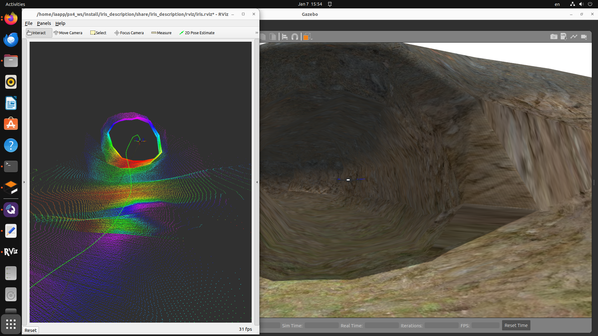

# px4_map_app

This package implements a simulation that integrates PX4-Autopilot with a scanner for 2D mapping in ROS 2 and Gazebo Classic.

## Requirements
To run this package, you need to build from source or install the following packages via `apt`:

- **px4_msgs** ([GitHub Repository](https://github.com/PX4/px4_msgs))
- **px4_ros_common** ([GitHub Repository](https://github.com/PX4/px4_ros_com))
- **iris_description** ([GitHub Repository](https://github.com/FredMSaico/iris_description))
- **px4_pose** ([GitHub Repository](https://github.com/FredMSaico/px4_pose))
- **pointcloud_to_laserscan** ([GitHub Repository](https://github.com/ros-perception/pointcloud_to_laserscan))

Additionally, ensure you have PX4-Autopilot installed. You can find the repository here: [PX4-Autopilot Repository](https://github.com/PX4/PX4-Autopilot). Follow the setup instructions here: [PX4-Autopilot Setup](https://docs.px4.io/main/en/dev_setup/dev_env_linux_ubuntu.html).
## Steps to Run the Simulation

1. **Start PX4 SITL with Gazebo Classic**:
   ```bash
   make px4_sitl_default gazebo-classic_iris__cpr_inspection
   ```

2. **Run the Micro XRCE Agent**:
   ```bash
   MicroXRCEAgent udp4 -p 8888
   ```

3. **Launch the ROS 2 Node**:
   ```bash
   ros2 launch px4_map_app px4_map.launch.py
   ```

4. **Open QGroundControl** and choose one of the following options:
   - **Option 1**: Plan a flight area.
   - **Option 2**: Connect an RC controller and teleoperate.

## PX4 Mapping Example


*Caption: PX4 Mapping Example*
